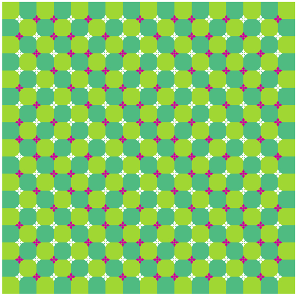

# 錯視產生

錯視是因為大腦產生認知上的判斷錯誤，人體對視覺適應現象，人的感覺器官在接受過久的刺激後會鈍化，也就造成了補色及視覺暫留的生理錯覺。目前在學術解釋上產生錯視的原因有以下:

* **眼球顫動所致** 我們的眼睛在移動時，可能會干擾視覺訊息的分析，即使我們定住眼睛凝視事物時，也會有微小的眼球顫動，這些都可能會干擾視覺訊息，讓我們產生錯視。
* **大腦對於不同亮度的處理速度不同，因而讓大腦誤以為這些資訊在移動。** 例如，可能大腦處理黑色的速度快於白色，就會誤以為是黑色往白色移動。
* **大腦對於不同「對比度」（contrast）的處理速度不同，因而讓大腦誤以為這些資訊在移動。** 此理論和第一個理論類似，不同之處在於，這個理論認為大腦處理的對象並不是某個位置的「絕對亮度」，而是該處亮度與臨近亮度或整體亮度的「對比度」。

### 北岡明佳「旋轉之蛇」

### [北岡明佳是日本知名的心理學家作品集](http://www.ritsumei.ac.jp/~akitaoka/?fbclid=IwAR2WfSfZl23pdK0Jt7Q_cMVwwP70W-5zv6mJbdJhj2td5rsCzss2fLmqcNY)連結

### 

